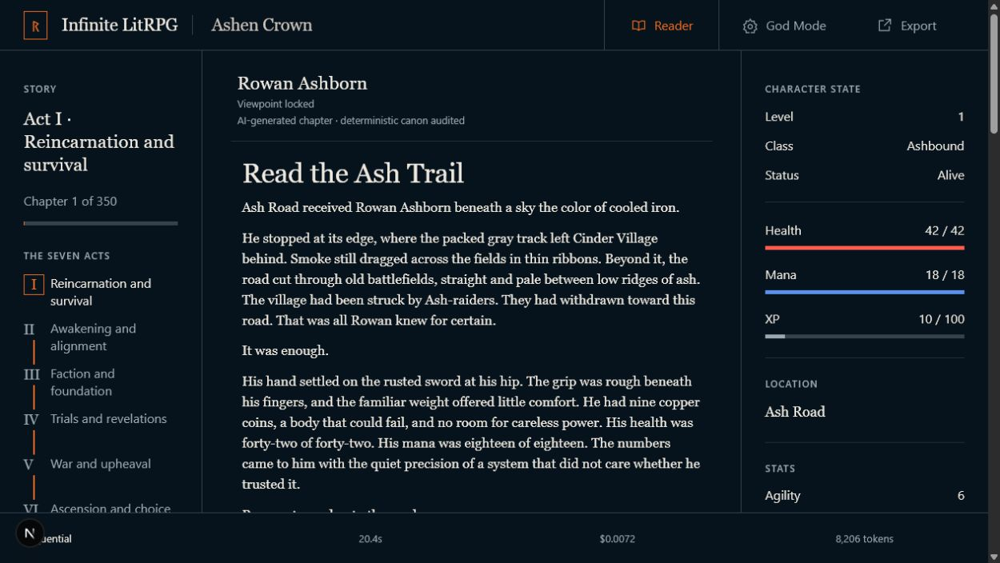
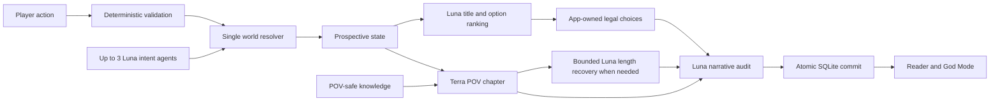

# Infinite LitRPG

Infinite LitRPG is a local, bring-your-own-key story engine for one locked viewpoint inside a living six-character world. The original Ashen Crown setting follows a reincarnated Demon King through seven acts. The story ends by chapter 350. Chapter 351 cannot run.

AI generates chapter prose and background-character intents. Deterministic application code validates actions, owns canon, audits every chapter, and commits the accepted world delta atomically.



## Requirements

- Node.js 24 or newer
- npm 11 or newer
- An OpenAI API key with GPT-5.6 Sol, Terra, and Luna access

## Run locally

```powershell
git clone git@github.com:shivam-g10/infinite-litrpg.git
Set-Location infinite-litrpg
npm ci
Copy-Item .env.example .env
```

Put the key in root `.env`:

```dotenv
OPENAI_API_KEY=
OPENAI_MAX_COST_USD_PER_CHAPTER=0.10
OPENAI_MAX_BACKGROUND_AGENTS=3
OPENAI_NATIVE_MULTI_AGENT=false
```

Paste the key after the first equals sign.

Start the app:

```powershell
npm run dev
```

Open `http://127.0.0.1:3000`. Choose one of six characters. The viewpoint locks for that local world. Runtime state stays in ignored `data/ashen-crown.db`.

Set `OPENAI_NATIVE_MULTI_AGENT=true` to use the native Multi-agent beta. The default sequential Luna adapter preserves the same intent schema and deterministic resolver.

## Architecture



Models emit intent or prose. They never mutate canonical state. Accepted `WorldDelta` is the only source of new canon. Narration sees only the selected character's knowledge. Rejected prose never reaches the reader because generation is buffered, audited, then replayed as NDJSON.

See [architecture](docs/ARCHITECTURE.md), [domain model](docs/DOMAIN_MODEL.md), and [security](docs/SECURITY.md).

## Model roles

| Work                                                       | Model           |
| ---------------------------------------------------------- | --------------- |
| World genesis, hard recovery, finale                       | `gpt-5.6-sol`   |
| Custom-action translation and narration                    | `gpt-5.6-terra` |
| Background intents, option ranking, length recovery, audit | `gpt-5.6-luna`  |

Only the OpenAI Responses API is used.

## Verify

```powershell
npm run check
```

This runs format, lint, strict type checks, unit tests, 1,000 deterministic simulations, POV and chapter-350 evals, production build, desktop and mobile E2E tests, secret and client-bundle scans, and license checks.

Live API evals are separate and capped:

```powershell
npm run evals:live:smoke
npm run evals:live:full
```

The full command requires explicit `--confirm-cost` through its npm script. Reports stay in ignored `evals/reports/`. See [eval gates](evals/README.md) and [current status](docs/STATUS.md).

## Safety

- The API key stays server-side and is never written to traces or exports.
- Reader JSON excludes hidden world facts and other characters' private ledgers.
- God Mode JSON is an explicit full-canon export.
- Every request carries a UUID and expected world version for replay safety.
- Per-chapter cost, retries, timeout, and background concurrency are bounded. Generation uses a byte-based worst case first. When that bound would falsely block, the official input-token counter supplies an exact count plus a 512-token margin. Counter failure keeps the byte bound. Unknown response cost keeps its reservation, and failed exposure carries into later chapter retries.

## Build Week

Track: Apps for Your Life. Demo materials and submission evidence live in [Build Week notes](docs/BUILD_WEEK.md).

## License

[MIT](LICENSE)
