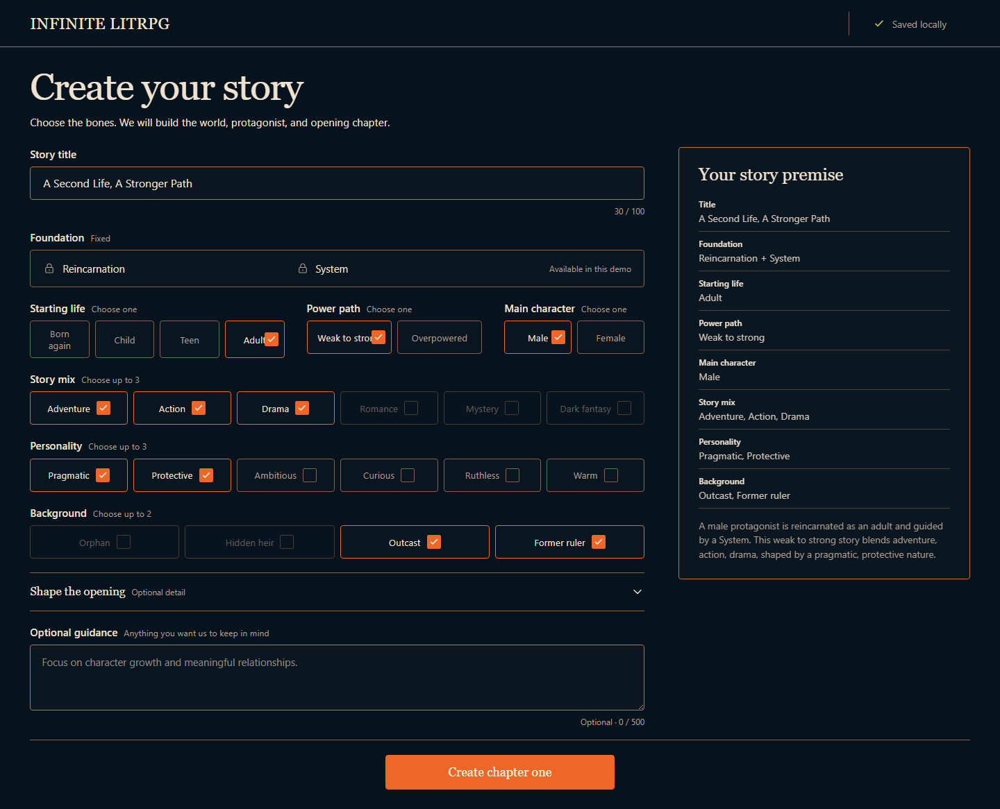

# Infinite LitRPG

Local, single-user LitRPG story generator. Bring an OpenAI API key, choose a reincarnation setup, then read and steer a private chapter-by-chapter story.



[Watch the 2:48 Build Week demo](https://youtu.be/Mmb5XsgcF_0).

## Implemented

- Reincarnation and an explicit LitRPG System are fixed foundations.
- Reader chooses title, starting life stage, gender, power path, genres, background, personality, rebirth cause, memory state, System focus, optional protagonist name, and up to 500 characters of guidance.
- Terra proposes the initial canon. Candidate contains protagonist, five supporting roles, System rules and class, two starting skills, zero to six items, five to nine connected locations, three to six factions, incident, threat, discoverable facts, relationships, opening action, seven milestones, and ending constraints.
- Deterministic TypeScript compiles stable internal IDs and rejects invalid schemas, references, topology, inventory, actions, and unmet concrete guidance. Terra then audits coherence. Generation gets at most three candidate cycles.
- Accepted genesis becomes Chapter 0 canon. Same streamed request then generates, audits, commits, and opens Chapter 1.
- Reader can pick a supplied action, enter a custom action, generate one routine chapter, generate through the next decision, reroll latest chapter, move between saved books, restart a book, and export Markdown or reader-safe JSON.
- SQLite owns canon. Chapter Markdown files are readable projections. One writer atomically commits world delta, knowledge delta, chapter, usage, and version.
- Character agents receive only allowed knowledge and emit intent. They never mutate canon.
- UI stops automatic generation at Chapter 100. Engine has seven acts of at most 50 chapters, makes Chapter 350 terminal, and blocks Chapter 351 before any model call.

## Current limits

- Local app only. No auth, sync, hosted service, payments, analytics, public feed, images, audio, or mobile app.
- Generation spends against supplied OpenAI account. App has no token or cost ceiling.
- Active request keeps running after browser disconnect only while local server process stays alive. Multi-chapter continuation is browser-driven: keep tab open. It sends one chapter request at a time and can stop after active chapter.
- Story creation deduplication exists only inside active server process.
- Stories created before generated-genesis record existed are read-only. They can still be opened and exported, but cannot continue, reroll, or restart.
- Automated checks enforce structure and safety. Human review still decides prose and story quality.

## Run

Requirements: Node.js 24 or newer, npm, and OpenAI API access to GPT-5.6 Sol, Terra, and Luna.

### Windows PowerShell

```powershell
npm ci
Copy-Item .env.example .env
```

### macOS and Linux

```bash
npm ci
cp .env.example .env
```

Set key in `.env`:

```dotenv
OPENAI_API_KEY=
OPENAI_MAX_BACKGROUND_AGENTS=3
OPENAI_NATIVE_MULTI_AGENT=false
```

`OPENAI_MAX_BACKGROUND_AGENTS` accepts 0 through 3. Native Multi-agent is optional beta path; default uses concurrent application requests.

Start app:

```powershell
npm run dev
```

Open `http://127.0.0.1:3000`.

API key stays server-side. App rejects story generation when key is missing, but provider-free checks need no key.

## Model roles

| Work                         | Model         | Reasoning |
| ---------------------------- | ------------- | --------- |
| Genesis candidate            | GPT-5.6 Terra | medium    |
| Genesis audit                | GPT-5.6 Terra | low       |
| Background character intents | GPT-5.6 Luna  | none      |
| Chapter frame and narration  | GPT-5.6 Sol   | medium    |
| Custom-action translation    | GPT-5.6 Terra | none      |
| Chapter narrative audit      | GPT-5.6 Terra | low       |

App uses OpenAI Responses API only. With native Multi-agent disabled, up to three Luna calls run concurrently. Optional native adapter stays behind same intent schemas and deterministic resolver.

All model output is untrusted. Strict schemas parse proposals before deterministic validation. Accepted `WorldDelta` is only source of new chapter canon. Terra audit cannot create state.

## Local data

Stories are Git-ignored:

```text
stories/
  library.json
  <story-id>/
    story.db
    chapter-001.md
    chapter-002.md
```

Rejected and restarted drafts remain on disk and appear in Rejected library section. Missing Markdown projection is rebuilt from SQLite without model call. Accepted genesis and exact initial world are stored for replay and reroll.

## Verify

```powershell
npm run format:check
npm run lint
npm run typecheck
npm run test
npm run evals
npm run build
npm run test:e2e
npm run check
```

`npm run check` is provider-free. It runs formatting, lint, strict TypeScript, unit tests, offline evals, build, Playwright, secret scan, browser-bundle scan, license gate, dependency audit, and diff check. Clean-clone verification is separate:

```powershell
npm run verify:clean-clone
```

## How I used Codex

I am a senior developer, but for this project I deliberately tried to stay out of the code. I wanted to test whether I could direct Codex through product intent, operating rules, and feedback instead of reviewing every implementation detail.

Work started before this repository existed. I asked Codex to run the full product-research workflow on a broader personalized webnovel idea. It researched competitors, long-story memory, per-chapter economics, public sharing, moderation, and legal risk; wrote a POC and RICE score; and initially recommended **HOLD**. For Build Week I narrowed the bet to a private, local-first LitRPG slice with one hard continuity problem. Codex re-ran feasibility against that scope and changed the decision to **GO**.

I started with an alignment document and repository instructions. [`AGENTS.md`](AGENTS.md) locks product and engineering boundaries. [`LOOP.md`](LOOP.md) tells Codex how to research, plan, implement, verify, record results, and continue. [`docs/PLAN.md`](docs/PLAN.md) and [`docs/STATUS.md`](docs/STATUS.md) became the shared control surface for the active milestone, evidence, failures, and next action.

I ran the main build as a long-lived Codex goal with Ultra reasoning for about three days. Codex handled product research, architecture, TypeScript implementation, OpenAI integration, deterministic validation, SQLite storage, evals, browser QA, documentation, and repository cleanup. It used bounded subagents for independent research, test runs, log analysis, and review while the root agent kept implementation ownership.

This was not one prompt followed by passive acceptance. I used the running product and steered Codex with concrete reader feedback:

- I rejected weak prose with little dialogue, character growth, System presence, or story progression. I also called out repeated openings and chapter titles.
- I asked for a clean reader, background generation, book switching, rerolls, rejected drafts, restarts, and removal of cost and God Mode clutter.
- I rejected the first “fresh world” implementation because it only renamed one Ash-themed fixture while keeping the same topology, inventory, clues, and opening. Codex replaced it with strict server-generated genesis.
- I supplied live failure logs when a generated local character could not be investigated. Codex traced the resolver mismatch, removed remaining hard-coded actor IDs, added regressions, and retried the exact failed saved story through Chapter 1.
- I stopped Codex when it over-invested in eval loops and tests for a prototype. It narrowed verification to useful invariant, storage, recovery, and browser gates, then removed obsolete eval and review machinery.

Codex did the research, coding, debugging, testing, browser checks, and documentation. I owned product scope, reader judgment, corrections, and release decisions. Human review remained the final gate because structural evals can catch broken canon, but they cannot decide whether a LitRPG chapter is interesting.

The [2:48 demo](https://youtu.be/Mmb5XsgcF_0?t=95) explains this workflow from 1:35 onward. Repository history and [Build Week evidence](docs/BUILD_WEEK.md) show the implementation and correction trail.

Read [Architecture](docs/ARCHITECTURE.md), [Product contract](docs/PRODUCT.md), [Security](docs/SECURITY.md), [Build Week evidence](docs/BUILD_WEEK.md), [living plan](docs/PLAN.md), and [decision records](decisions/README.md).

## Demo

Use [Human review](docs/HUMAN_REVIEW.md) and [three-minute script](docs/DEMO_SCRIPT.md).

## License

[MIT](LICENSE)
