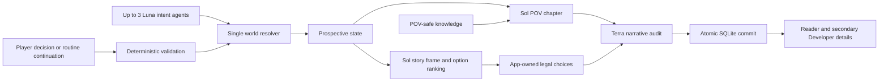

# Infinite LitRPG

Infinite LitRPG is a local, bring-your-own-key story engine for one locked viewpoint inside a living six-character world. The original Ashen Crown setting follows a reincarnated Demon King through seven acts. The story ends by chapter 350. Chapter 351 cannot run.

AI generates chapter prose and background-character intents. Deterministic application code validates actions, owns canon, audits every chapter, and commits the accepted world delta atomically.


## Requirements

- Node.js 24 or newer
- npm 11 or newer
- An OpenAI API key with GPT-5.6 Sol, Terra, and Luna access

## Run locally

```powershell
git clone https://github.com/shivam-g10/infinite-litrpg.git
Set-Location infinite-litrpg
npm ci
Copy-Item .env.example .env
```

Put the key in root `.env`:

```dotenv
OPENAI_API_KEY=
OPENAI_MAX_BACKGROUND_AGENTS=3
OPENAI_NATIVE_MULTI_AGENT=false
```

Paste the key after the first equals sign.

Start the app:

```powershell
npm run dev
```

Open `http://127.0.0.1:3000`. Choose one of six characters. The viewpoint locks for that story. Continue one chapter or let routine chapters build in the background until the next meaningful decision. The Reader stays on the chapter you are reading. The demo flow pauses after chapters 47 and 97 and stops at chapter 100.

Each local story lives under ignored `stories/<story-id>/`: canonical state in `story.db`, plus one readable `chapter-###.md` file per committed chapter. The story library can start, switch, reject, reopen, or restart drafts. Rewriting the latest chapter changes prose only; accepted canon stays fixed.

For the no-cost UI review, exact chapter-100 behavior proof, and live review command, use the [human review guide](docs/HUMAN_REVIEW.md). The [sample file](docs/SAMPLE_STORIES.md) becomes the six-story progression packet only after the fresh 60-chapter run. It never feeds story generation. Its status is recorded in [current status](docs/STATUS.md).

Set `OPENAI_NATIVE_MULTI_AGENT=true` to use the native Multi-agent beta. The default sequential Luna adapter preserves the same intent schema and deterministic resolver.

Product requests explicitly use Standard processing. Flex is isolated to the release eval command and cannot change product runtime behavior.

## Architecture



Models emit intent or prose. They never mutate canonical state. Accepted `WorldDelta` is the only source of new canon. Narration sees only the selected character's knowledge. Rejected prose never reaches the reader because generation is buffered, audited, then replayed as NDJSON.

See [architecture](docs/ARCHITECTURE.md), [domain model](docs/DOMAIN_MODEL.md), and [security](docs/SECURITY.md).

## Built with Codex

Codex supported the project from source research through release evidence. It created visual concepts before frontend work, implemented strict TypeScript contracts and deterministic state transitions, built both OpenAI adapters, exercised the real UI in desktop and mobile browsers, reviewed security and cost accounting, and maintained the living plan and evidence log.

AI behavior changed only after a recorded baseline. Every escaped live defect became a named regression. Independent Codex agents handled bounded research, evaluation, and review while the root build task kept implementation ownership and final decisions.

Key product decisions stayed human-readable in `decisions/`: one canonical state writer, accepted `WorldDelta` as the sole source of new canon, permanent POV knowledge boundaries, hard chapter-351 rejection, local bring-your-own-key operation, and no hosted service. GPT-5.6 Sol, Terra, and Luna have bounded roles; deterministic application code retains authority.

See the [living plan](docs/PLAN.md), [decision records](decisions/), [verified status](docs/STATUS.md), and [submission packet](docs/SUBMISSION.md).

## Model roles

| Work                                      | Model           |
| ----------------------------------------- | --------------- |
| Custom-action translation and story audit | `gpt-5.6-terra` |
| Background character intents              | `gpt-5.6-luna`  |
| Story frame and narration                 | `gpt-5.6-sol`   |

Only the OpenAI Responses API is used.

## Verify

```powershell
npm run check
```

This runs format, lint, strict type checks, unit tests, 1,000 deterministic simulations, POV and chapter-350 evals, production build, desktop and mobile E2E tests, secret and client-bundle scans, license checks, the required six-by-ten story-review check, dependency audit, and diff hygiene. The full command intentionally remains red until that authentic long-form artifact exists.

Live API work is separate from non-live checks. Current six-story review uses explicit unbounded-cost confirmation while recording actual usage:

```powershell
npm run review:stories:preflight
npm run review:stories:live -- --confirm-unbounded-cost
npm run review:stories:check
```

Preflight authenticates source, recovery state, and progress without loading an API key, creating a provider client, writing a report, or changing the spend ledger. The paid command has no application cost, output-token, prompt-byte, or prose-length ceiling. Provider limits, finite retries, timeouts, canon checks, and the fixed 60-chapter horizon remain. Reports stay in ignored `evals/reports/`. See [eval gates](evals/README.md) and [current status](docs/STATUS.md).

## Safety

- The API key stays server-side and is never written to traces or exports.
- Reader JSON excludes hidden world facts and other characters' private ledgers.
- Developer JSON is an explicit full-canon export.
- Every request carries a UUID and expected world version for replay safety.
- Multi-chapter continuation shows its exact chapter target, runs in the background, and carries a server-validated stop chapter. Automatic continuation cannot cross a meaningful decision or chapter 100.
- Retries, timeout, and background concurrency remain finite. Product generation omits `max_output_tokens` and has no local prose-length or cost ceiling. Actual provider usage and cost stay in server-side Developer evidence. Returned tier mismatch fails, and unknown interrupted usage stays recorded for reconciliation.

## Build Week

Track: Apps for Your Life. See [Build Week notes](docs/BUILD_WEEK.md), [timed demo script](docs/DEMO_SCRIPT.md), and [submission packet](docs/SUBMISSION.md).

## License

[MIT](LICENSE)
