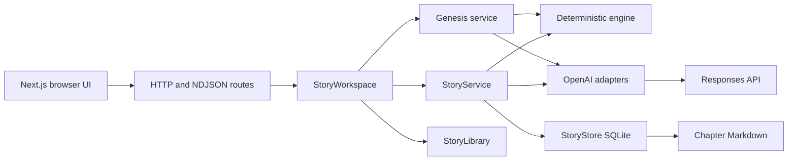
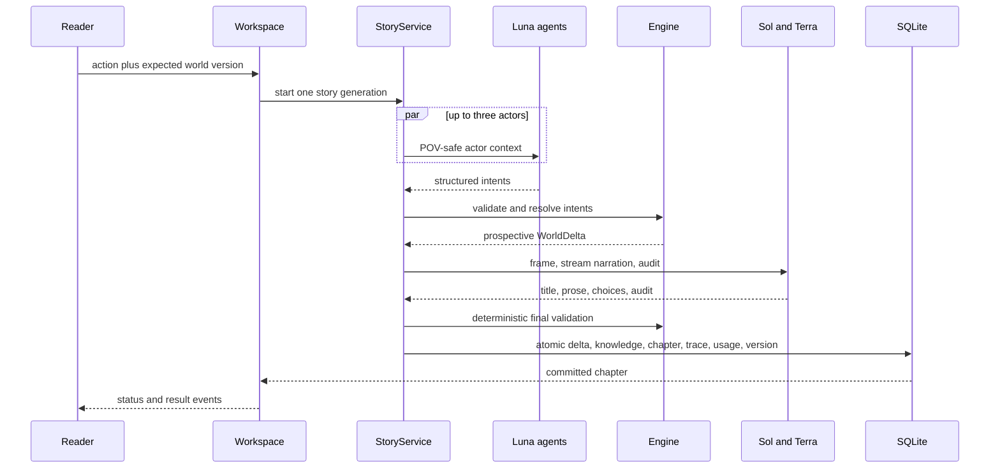

# Architecture

## System map



The boundary is simple: models suggest; application code decides and commits.

## Systems

| System             | Responsibility                                                                              | Main code                                                |
| ------------------ | ------------------------------------------------------------------------------------------- | -------------------------------------------------------- |
| Creator and reader | Click-based setup, library switching, chapter navigation, choices, progress, reroll, export | `app/src/components/`                                    |
| HTTP layer         | Story CRUD, responsive reads, NDJSON generation stream, safe errors                         | `app/src/app/api/`, `app/src/server/story/story-http.ts` |
| Workspace          | One runtime per story, per-story generation lock, background task status, library routing   | `app/src/server/story/story-workspace.ts`                |
| Genesis service    | Terra candidate, deterministic compile, Terra audit, three cycles                           | `app/src/server/story/genesis-service.ts`                |
| Story service      | Orchestrates one chapter without giving models write authority                              | `app/src/server/story/story-service.ts`                  |
| OpenAI adapters    | Responses API calls, streaming, strict structured output, retries, timeout, usage           | `app/src/server/openai/`                                 |
| Domain engine      | Schemas, world rules, resolver, POV filtering, story setup, narrative validation            | `shared/src/`                                            |
| Persistence        | Atomic SQLite state plus reader-safe Markdown projections                                   | `app/src/server/storage/`                                |
| Offline gates      | Deterministic invariants, POV isolation, long-horizon and terminal checks                   | `evals/`                                                 |

## Story creation

The creator submits `StorySetupV2`: reader selections, optional protagonist name, and guidance only. Client world and cast fields are rejected.

Terra medium generates `StoryGenesisCandidateV1`. The deterministic compiler assigns stable actor and internal IDs, validates topology, references, inventory, equipment, opening action, facts, milestones, and concrete guidance. Terra low audits coherence and setup compliance. Three candidate cycles are allowed. The accepted genesis, exact initial world, opening action, hashes, calls, usage, and cost commit atomically before Chapter 1.

The legacy Demon King fixture remains test and compatibility data. Production story creation never loads it. Stories without a genesis record are readable and exportable but reject mutation with `LEGACY_STORY_READ_ONLY`.

Each story gets its own directory and SQLite database. The library stores only story metadata and the active story ID.

## Chapter transaction



Detailed order:

1. Load the expected immutable world version and selected POV knowledge.
2. Validate the player action. Translate custom text to a supported action when needed.
3. Select at most three relevant background actors.
4. Run their Luna intent calls concurrently. Native Multi-agent is an optional adapter.
5. Parse strict schemas and run the deterministic resolver.
6. Stage the accepted `WorldDelta` in memory. Canon is still unchanged.
7. Ask Sol for a story frame and legal choice ranking.
8. Stream a complete Sol chapter into a server buffer. Partial prose never reaches the reader.
9. Run deterministic narrative checks and an independent Terra audit.
10. Atomically commit the delta, knowledge changes, chapter, trace, usage, and next version.
11. Write `chapter-NNN.md` from the committed reader-safe record.

Any failure before step 10 leaves canon unchanged.

## Canon and knowledge

`WorldState` is the canonical snapshot. `WorldDelta` is the only way to create new canon. Agents cannot directly alter either.

Each character has a `KnowledgeLedger`. Prompts receive only that actor's allowed facts, observations, and prior safe history. Narration receives the selected viewpoint's prospective canon. The audit sees the allowed and forbidden boundaries and rejects leaks.

The seven-act clock advances deterministically. Chapter 100 is the demo horizon. Chapter 350 is terminal. Chapter 351 fails before provider work.

## Generation and concurrency

Generation state belongs to `StoryWorkspace`, not a browser request. Closing or refreshing the page does not cancel the task. The API emits NDJSON status events while connected. Responsive reads return the latest committed chapter plus current generation status.

The lock is per story. One story cannot start duplicate chapter work, but other stories remain readable and can generate independently. Within a chapter, background intent calls use `Promise.all` with a maximum of three actors.

## OpenAI boundary

- Responses API only.
- Sol: frame and streamed narration.
- Terra: custom-action translation and independent audit.
- Luna: structured background intent.
- Structured calls use Zod-backed response formats.
- Refusal, invalid output, timeout, tier mismatch, or exhausted retry returns a typed error and no canonical mutation.
- The API key is read only by server modules.

## Storage

```text
stories/library.json                  story list and active ID
stories/<story-id>/story.db           canonical state, chapters, traces, usage
stories/<story-id>/chapter-001.md     reader-safe projection
```

Important SQLite records include setup version two, accepted genesis and initial-world snapshot, world snapshots, character state, knowledge, accepted deltas, chapter records, turn receipts, traces, and usage. Replay and re-narration start from the stored initial world. Genesis never runs twice for one saved story.

## Reader safety

The browser receives only reader state. It does not receive hidden facts, background ledgers, raw prompts, audit instructions, cost telemetry, or trace payloads. Exports are Markdown or reader-safe JSON.

See [Domain model](DOMAIN_MODEL.md) and [Security](SECURITY.md).

## Repository layout

```text
app/                 Next.js UI, routes, OpenAI adapters, workspace, storage
shared/              framework-independent contracts and deterministic engine
evals/               provider-free acceptance simulations
scripts/             security, license, bundle, and clean-clone checks
docs/                product, architecture, demo, and current status
research/            source notes used for product decisions
decisions/           historical architecture decisions
stories/             ignored local user data
```
