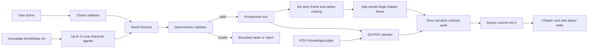

# Architecture

## Boundary

Deterministic application owns truth. Models propose structured data and prose. Models never own commits.

## Chapter Pipeline

1. Load story, locked POV, immutable state version, arc clock, and relevant actors.
2. Validate user action against known abilities and current situation.
3. Run maximum three Luna background intents from same state version.
4. Resolve user attempt and intents into proposed `WorldDelta`.
5. Parse strict schema. Refusal or incomplete output causes no mutation.
6. Recompute canonical intent disposition and require events, state mutations, and knowledge mutations to exactly equal deterministic resolver output.
7. Stage prospective state in memory. Canon remains at current version.
8. Give Sol the complete prior chapter history plus POV-safe prospective canon. Sol proposes the title and ranks legal option IDs. Application code owns terminal state, actions, choice IDs, descriptions, and milestone targets, then reruns deterministic safety and legality checks.
9. Give Sol the same full history and only the selected viewpoint's allowed canon. Background Luna actors never receive hidden full prose; they receive every prior chapter through their own POV-safe canon history.
10. Ask for one complete scene at its natural length. No local output-token, prompt-byte, prose-length, or cost ceiling truncates it. Deterministic quality, canon, POV, completion, and novelty gates still reject bad prose.
11. Run the independent Terra narrative contract audit over the final prose and full history.
12. Atomically commit delta, knowledge, chapter, trace metadata, usage, cost, and next version.

Narration failure leaves canon unchanged. Accepted `WorldDelta` is sole source of new canon. Audit can reject prose but cannot add state mutations.

From chapter 48 through 50 of each act, choices stay milestone-compatible. An incomplete milestone requires a direct typed target. The locked POV can target the milestone through `investigate.subjectId` or a supported `targetId`; background agents cannot claim that abstract target.

Reader input follows that same deterministic milestone policy. The opening and an incomplete milestone require a player choice. Otherwise `continue_story` may use only the persisted application-owned `choice-1`. The server computes the next decision or chapter-100 stop and requires every request to carry that approved stop chapter. A stale, broader, milestone-crossing, or post-100 automatic request fails before provider work. The browser runs one atomic request at a time, keeps the open chapter pinned, and can stop only after the active chapter settles. Chapter 100 is a demo horizon; chapter 350 remains the canonical terminal.

## Model Routing

| Work                                       | Model           | Baseline effort |
| ------------------------------------------ | --------------- | --------------- |
| Custom-action translation                  | `gpt-5.6-terra` | none            |
| Character intents                          | `gpt-5.6-luna`  | none            |
| Story frame and narration                  | `gpt-5.6-sol`   | medium          |
| Independent narrative and continuity audit | `gpt-5.6-terra` | low             |

The seven-act world blueprint is a versioned local fixture. Chapter 350 uses the same validated narration path and deterministic terminal guard as every other chapter.

Use Responses API. Use strict structured outputs for state-changing calls. Measure before changing effort.

Product requests explicitly send the Standard provider tier. The release-only review explicitly sends Flex. Runtime schema `1.1.0-runtime-candidates-5` records both requested and observed tier. Standard returns provider value `default`; Flex returns `flex`. Missing, `auto`, or mismatched values fail closed. Tier-specific pricing records measured usage and durable interruption telemetry without enforcing a local spend ceiling.

## Multi-Agent Adapter

- Native beta SDK path uses `client.beta.responses.create`, `multi_agent.enabled`, `max_concurrent_subagents: 3`, and `betas: ["responses_multi_agent=v1"]`. Raw HTTP and WebSocket use `OpenAI-Beta: responses_multi_agent=v1`.
- Default and hard maximum concurrency: three.
- All runtime agents in one native tree share request model and tools.
- Preserve multi-agent output items and identities in trace.
- Sequential fallback runs same Luna prompts through same resolver and schemas.
- UI labels active path clearly. Never pretend sequential path was parallel.

## Storage

Each story owns `stories/<story-id>/story.db`. SQLite is canonical. `chapter-###.md` files beside it are reader-safe, crash-recoverable projections. `stories/library.json` selects the active draft and retains rejected drafts without deletion.

Required transaction:

- compare expected `world_version`.
- insert accepted delta.
- update world and character state.
- append knowledge changes.
- insert chapter record.
- insert trace metadata and usage.
- increment version once.

Rollback everything on failure.

## Trace Envelope

- run ID, Git SHA, fixture ID, seed.
- prompt and schema versions.
- exact model slug, reasoning settings, response IDs.
- requested service tier, observed service tier, and pricing-table version.
- state-before hash, intents, accepted delta, state-after hash.
- multi-agent output items.
- tokens, cached tokens, reasoning tokens, latency, estimated cost.
- refusal, retry, timeout, validation failure.
- final gate result.

Successful chapter traces include every attempt for that world version, including attempts from earlier failed retries. Fully failed turns persist a separate strict failure trace without mutating canon. Sequential Luna attempts retain the responsible character ID.

Never store API key or raw environment.

## Planning Envelope

These long-horizon estimates use Standard product pricing. Release-eval Flex pricing is separate, versioned telemetry. These numbers inform the operator; they never stop generation.

- Estimated full chapter before retries: about `$0.075`.
- Estimated full chapter with 20 percent retry allowance: about `$0.09`.
- Estimated 350 chapters: about `$31.50`, plus genesis and user regenerations.
- World tick p50 target: at most 15 seconds.
- Streamed full chapter p95 target: at most 60 seconds.

These are planning estimates. Runtime usage fields are token source of truth. OpenAI responses do not return cost. The clean Reader hides telemetry; secondary Developer details shows tokens, latency, and locally estimated cost from a versioned pricing table.

Current product and six-story review requests omit `max_output_tokens`. They send the complete required story context and accept a complete scene at natural length, subject only to OpenAI's native model context and output limits. Local code records token usage and estimated cost after each request but does not block, truncate, or abort on either value. Finite validation retries, timeouts, canon checks, POV checks, and chapter 350 remain safety and correctness guards.

## Live Eval Spend Ledger

Release evals keep a durable accounting layer without an enforced spend limit:

1. Acquire the single SQLite run lock.
2. Reconcile the authenticated source report with the stored baseline and settled reservations.
3. Record the request's estimated exposure in integer nano-USD with `BEGIN IMMEDIATE` before transport.
4. Settle known usage before parsing or validating model output. Keep the maximum reservation when usage is unknown.
5. Atomically replace the JSON report after every committed chapter and at run end.

Ledger version 2 stores the requested service tier on every request record. Opening a version 1 ledger adds Standard to historical rows in one immediate transaction and verifies that exact nano-USD exposure did not change. SQLite uses WAL and full synchronous writes. A killed process leaves both its request record and run lock intact. An active provider request requires external reconciliation; deleting the ledger would destroy provenance.

An explicit stale-run takeover is allowed only when the recorded process is dead, the caller supplies the exact old run ID, and no provider reservation remains active. It transfers the lock in one immediate transaction without changing exposure. The new run must still reconcile its source report before it can reserve a request.

If one exact request remains active after process death, a separate tracked interruption checkpoint must bind the source commit, immutable sidecar hash, run and turn identities, every reservation, and recovery-code hashes. The no-network reconciler verifies all fields in one immediate transaction, converts only the registered unknown request to uncertain at full maximum, atomically writes and rereads a strict receipt, then releases the lock. Any live owner, different row owner, missing row, changed cost, changed artifact, or unregistered bridge fails closed.

Version 7 reports retain authenticated contiguous chapter prefixes. Version 8 adds complete raw narrative and canonical transition evidence. Version 9 adds strict service-tier and projection provenance. Full version 9 reports require Flex and recompute a tier-evidence gate across current attempts, calls, traces, and sidecars. Historical reports remain readable as Standard evidence. Restoring chapter 1 restages the accepted `WorldDelta` from the seed fixture and verifies both state hashes. Retained results keep their source cap and Git SHA. New results use the current cap and Git SHA.

Human-rejected prose can use the canon-preserving reroll path. It authenticates and exactly restages the retained before state, action, intents, delta, after state, frame, fact partitions, and trace identity before provider access. It reruns only the configured narrator and full audit; it never reruns agents or resolves new canon. A replacement gets new prose, audit, usage, request, turn, and stream evidence but keeps the exact canonical-source hash. The app archives the prior narration revision and atomically replaces only the latest prose.

This ledger covers locally estimated Responses generation exposure. It does not claim provider-invoice equality because the project key cannot read organization usage and the input-token counting endpoint exposes no cost.
