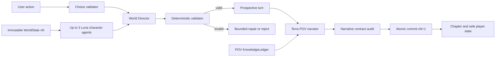

# Architecture

## Boundary

Deterministic application owns truth. Models propose structured data and prose. Models never own commits.

## Chapter Pipeline

1. Load story, locked POV, immutable state version, arc clock, and relevant actors.
2. Validate user action against known abilities and current situation.
3. Run maximum three Luna background intents from same state version.
4. Resolve user attempt and intents into proposed `WorldDelta`.
5. Parse strict schema. Refusal or incomplete output causes no mutation.
6. Check version, death, location, inventory, progression, knowledge, and clock invariants.
7. Stage prospective state in memory. Canon remains at current version.
8. Give Terra only POV-safe context and prospective visible events.
9. Generate complete 900 to 1,300 word chapter and run narrative contract audit.
10. Atomically commit delta, knowledge, chapter, trace metadata, usage, cost, and next version.

Narration failure leaves canon unchanged. Accepted `WorldDelta` is sole source of new canon. Audit can reject prose but cannot add state mutations.

## Model Routing

| Work | Model | Baseline effort |
| --- | --- | --- |
| World blueprint and seven-act constraints | `gpt-5.6-sol` | medium |
| Hard recovery and finale | `gpt-5.6-sol` | medium |
| Choice generation and narration | `gpt-5.6-terra` | none |
| Character intents and chapter fact audit | `gpt-5.6-luna` | none or low |

Use Responses API. Use strict structured outputs for state-changing calls. Measure before changing effort.

## Multi-Agent Adapter

- Native beta SDK path uses `client.beta.responses.create`, `multi_agent.enabled`, `max_concurrent_subagents: 3`, and `betas: ["responses_multi_agent=v1"]`. Raw HTTP and WebSocket use `OpenAI-Beta: responses_multi_agent=v1`.
- Default and hard maximum concurrency: three.
- All runtime agents in one native tree share request model and tools.
- Preserve multi-agent output items and identities in trace.
- Sequential fallback runs same Luna prompts through same resolver and schemas.
- UI labels active path clearly. Never pretend sequential path was parallel.

## Storage

Initial target: local SQLite.

Required transaction:

- compare expected `world_version`.
- insert accepted delta.
- update world and character state.
- append knowledge changes.
- insert chapter record.
- insert trace metadata and usage.
- increment version once.

Rollback everything on failure.

## Trace Envelope

- run ID, Git SHA, fixture ID, seed.
- prompt and schema versions.
- exact model slug, reasoning settings, response IDs.
- state-before hash, intents, accepted delta, state-after hash.
- multi-agent output items.
- tokens, cached tokens, reasoning tokens, latency, estimated cost.
- refusal, retry, timeout, validation failure.
- final gate result.

Never store API key or raw environment.

## Planning Envelope

- Estimated full chapter before retries: about `$0.075`.
- Estimated full chapter with 20 percent retry allowance: about `$0.09`.
- Estimated 350 chapters: about `$31.50`, plus genesis and user regenerations.
- POC live-eval budget: maximum `$3`.
- World tick p50 target: at most 15 seconds.
- Streamed full chapter p95 target: at most 60 seconds.

These are planning estimates. Runtime usage fields are token source of truth. OpenAI responses do not return cost, so UI must show actual tokens, latency, and estimated cost from a versioned pricing table after each call.
